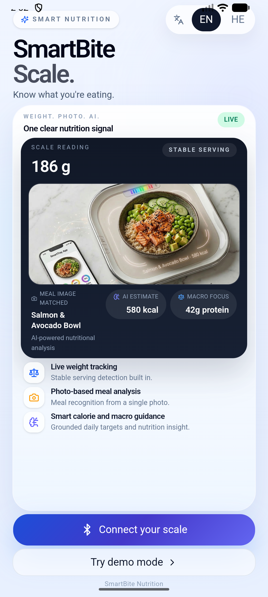
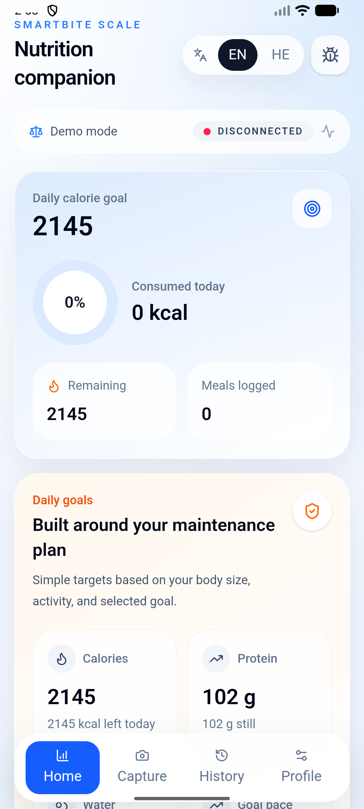
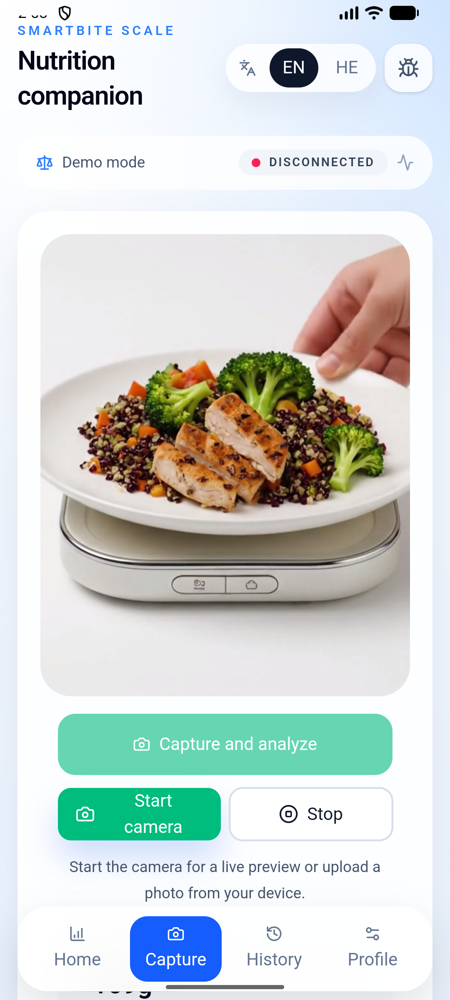
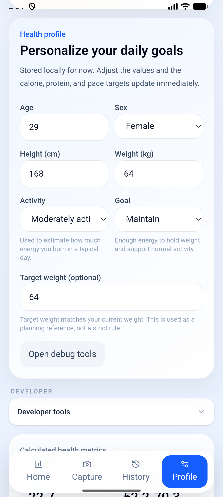
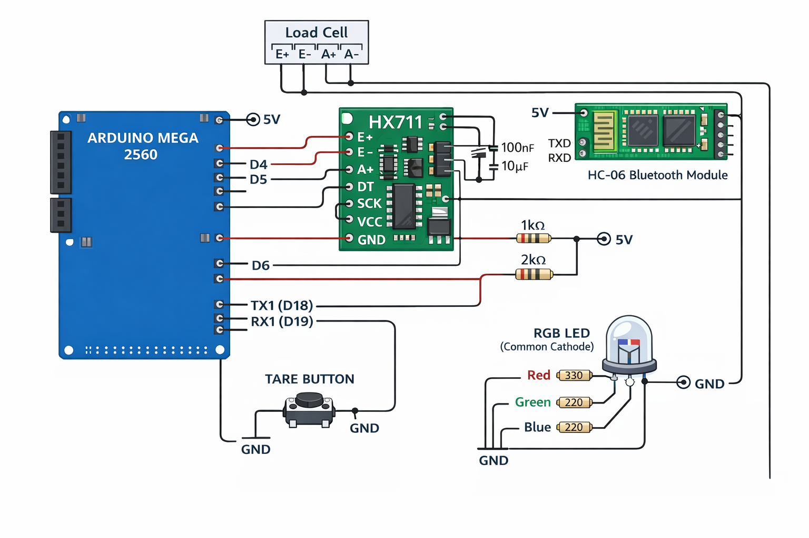

# SmartBite Scale ⚖️🍽️

> A full-stack IoT nutrition tracking prototype — AI meal analysis,
> custom Bluetooth hardware, and a mobile-first React app, all wired together.

<p align="center">
  
  
  
  
</p>

<p align="center">
  <sub>From left: Scale connection · Live dashboard · Meal capture · Profile & goals</sub>
</p>

---

## What is this?

SmartBite Scale is an end-to-end prototype that combines a **custom-built
Bluetooth food scale** with **AI-powered meal recognition** to give instant
nutritional estimates from a single photo — anchored to a real measured weight.

The project spans three layers:

| Layer | Technology |
|---|---|
| Mobile app | Next.js 15 + React 19 + Tailwind CSS + Framer Motion |
| AI backend | Google Gemini 1.5 Flash, server-side only, with OpenAI fallback |
| Hardware | Arduino Mega + HX711 load cell + HC-06 Bluetooth Classic |

---

## Why I built this

Most nutrition apps ask you to search a database and guess your portion size.
SmartBite removes both steps: the scale weighs the food, the camera identifies
it, and the AI combines both signals into a single macro estimate — no manual
input required.

---

## Technical highlights

- **Server-side AI key handling** — Gemini API key never reaches the client.
  All analysis goes through a Next.js API route with an OpenAI fallback chain.

- **Custom Bluetooth Classic protocol** — Arduino firmware streams
  `WEIGHT:123.45` over HC-06 RFCOMM. The Android app parses this in a
  dedicated hook with reconnect logic and a live debug console.

- **Dual build target** — `NEXT_OUTPUT_MODE=server` for hosted web,
  `NEXT_OUTPUT_MODE=export` for static Capacitor Android builds, controlled
  by a single environment variable.

- **Demo mode** — full app experience without hardware. Weight values are
  clearly marked as estimated, not measured. No silent faking.

- **Profile-based targets** — calorie and macro goals calculated from age,
  weight, height, activity level, and goal type.

- **Bilingual** — full English and Hebrew UI.

---

## Current status

This is an **active prototype**, not a production product.

**Working end-to-end today:**
- Photo capture → server-side Gemini analysis → macro result display
- Android Bluetooth Classic connect/disconnect/stream/tare flow
- Local meal history with per-entry detail view
- Profile-based daily nutrition targets
- Demo mode with consistent weight values across screens
- Android Capacitor shell with static export build

**In progress:**
- Production deployment and backend hosting
- `CALIBRATE:<float>` firmware command
- PWA / iOS distribution

---

## Architecture

```
┌─────────────────────────────────┐
│        Mobile App (Next.js)     │
│  React UI + Framer Motion       │
│  Capacitor Android shell        │
└────────────┬────────────────────┘
             │ /api/analyze-meal
┌────────────▼────────────────────┐
│      Next.js API Route          │
│  Gemini 1.5 Flash (primary)     │
│  OpenAI Vision (fallback)       │
└─────────────────────────────────┘

┌─────────────────────────────────┐
│      Arduino Mega Firmware      │
│  HX711 load cell → grams        │
│  HC-06 Bluetooth Classic        │
│  Serial protocol: WEIGHT / TARE │
└────────────┬────────────────────┘
             │ Bluetooth RFCOMM
┌────────────▼────────────────────┐
│   Android Bluetooth Hook        │
│   useBluetoothScale.ts          │
└─────────────────────────────────┘
```

---

## Hardware wiring

<p align="center">
  
  <br/>
  <sub>Figure 1 — SmartBite Scale wiring diagram (Arduino Mega 2560 + HX711 + HC-06 + RGB LED)</sub>
</p>

### Arduino Mega ↔ Modules

| From (Arduino Mega) | To / Module pin   | Via                           | Notes                        |
|---------------------|-------------------|-------------------------------|------------------------------|
| 5V                  | HX711 VCC         | —                             | HX711 power                  |
| GND                 | HX711 GND         | —                             | Common ground                |
| D4                  | HX711 DT          | —                             | HX711 data line              |
| D5                  | HX711 SCK         | —                             | HX711 clock line             |
| 5V                  | HC-06 VCC         | —                             | HC-06 power                  |
| GND                 | HC-06 GND         | —                             | Common ground                |
| D19 (RX1)           | HC-06 TXD         | —                             | HC-06 → Mega, no level shift needed |
| D18 (TX1)           | HC-06 RXD         | R4 1 kΩ + R5 2 kΩ divider    | Mega → HC-06, divided to ~3.3 V |
| D6                  | TARE button pin 1 | —                             | INPUT_PULLUP, active LOW     |
| GND                 | TARE button pin 2 | —                             | Button to ground             |

### Load Cell ↔ HX711

| From (Load Cell) | To (HX711) | Notes                                    |
|------------------|-----------|------------------------------------------|
| E+               | E+        | Excitation positive                      |
| E−               | E−        | Excitation negative                      |
| A+               | A+        | Signal positive                          |
| A−               | A−        | Signal negative                          |

> Check your specific load cell datasheet for wire color mapping.

### RGB LED (Common Cathode)

| From (Arduino Mega) | Via resistor | To (LED pin)   | Notes              |
|---------------------|--------------|----------------|--------------------|
| D9                  | R1 — 330 Ω   | Red            | Red channel        |
| D10                 | R2 — 220 Ω   | Green          | Green channel      |
| D11                 | R3 — 220 Ω   | Blue           | Blue channel       |
| GND                 | —            | Common cathode | Shared LED ground  |

### Decoupling capacitors

| Node              | Component | Value  | Notes                              |
|-------------------|-----------|--------|------------------------------------|
| HX711 VCC ↔ GND   | C1        | 100 nF | Ceramic, close to HX711 power pins |
| HX711 VCC ↔ GND   | C2        | 10 µF  | Electrolytic bulk cap              |
| HC-06 VCC ↔ GND   | C3        | 100 nF | Ceramic, close to HC-06 VCC/GND   |

### Component reference

| Ref | Value / Part        | Notes                             |
|-----|---------------------|-----------------------------------|
| U1  | Arduino Mega 2560   | Main controller                   |
| U2  | HX711               | 24-bit ADC load cell amplifier    |
| U3  | HC-06               | Bluetooth Classic UART module     |
| J1  | Load cell connector | 4-wire (E+, E−, A+, A−)          |
| SW1 | TARE button         | Momentary push button             |
| D1  | RGB LED             | 5 mm, Common Cathode              |
| R1  | 330 Ω               | Red LED current limit             |
| R2  | 220 Ω               | Green LED current limit           |
| R3  | 220 Ω               | Blue LED current limit            |
| R4  | 1 kΩ                | BT voltage divider (top)          |
| R5  | 2 kΩ                | BT voltage divider (bottom)       |
| C1  | 100 nF              | HX711 decoupling, ceramic         |
| C2  | 10 µF               | HX711 bulk decoupling             |
| C3  | 100 nF              | HC-06 decoupling, ceramic         |

---

## Repository layout

```
app/                          Next.js App Router + API routes
components/
  cards/                      Scale status, meal result, history cards
  screens/                    Home, Capture, History, Profile screens
  ui/                         Reusable components
hooks/                        Bluetooth, camera, meal analysis, profile
lib/
  ai/                         Gemini + OpenAI integration, mock fallback
  nutrition/                  Macro calculation helpers
  storage/                    Local history and profile persistence
  i18n/                       English / Hebrew translations
public/                       Static assets and icons
android/                      Capacitor Android project
firmware/
  arduino-mega-hc06/          Arduino Mega firmware (HX711 + HC-06)
images/                       App screenshots and circuit diagram
```

---

## Getting started

### Prerequisites

- Node.js 18+
- A Gemini API key (free) — [aistudio.google.com](https://aistudio.google.com)
- Android Studio (for mobile builds)
- Arduino IDE (for firmware, optional)

### Install and run

```bash
git clone https://github.com/torenniv/SmartBite-Scale.git
cd SmartBite-Scale
npm install
cp .env.example .env.local
npm run dev
```

Open [http://localhost:3000](http://localhost:3000) — demo mode works
immediately, no hardware needed.

### Environment

```env
# Server-only — never expose to client
GEMINI_API_KEY=your_key_here

# Build target: "server" for web hosting, "export" for Capacitor
NEXT_OUTPUT_MODE=server

# Frontend base URL — leave empty for local dev
NEXT_PUBLIC_API_BASE_URL=
```

### Android build

```bash
npm run build
npx cap sync android
npx cap open android
```

---

## Bluetooth protocol reference

The app communicates with the Arduino over HC-06 RFCOMM
(UUID `00001101-0000-1000-8000-00805F9B34FB`, baud `9600`).

**Arduino → App:**
```
WEIGHT:123.45   live weight in grams
STATUS:READY    scale initialized
TARE_DONE       tare completed
PONG            response to PING
```

**App → Arduino:**
```
TARE            zero the scale
STREAM_ON       start weight stream
STREAM_OFF      stop weight stream
PING            connection check
```

---

## Known limitations

- Bluetooth Classic support requires Chrome on Android
- AI macro accuracy depends on image quality and meal complexity
- `CALIBRATE:<float>` firmware command is not yet implemented
- No cloud sync — all data is stored locally in the browser
- Authentication is local-only (localStorage)

---

## Credits

The original SmartBite hardware concept and first physical prototype
(load-cell tray, mechanics and initial electronics) were co-designed in 2024
as a team project by **Adi**, **Freg'**, **Ori** and **Niv Toren**.

This repository contains a new, fully re-implemented firmware, updated wiring
diagram and mobile app, created and maintained by **Niv Toren**,
based on that original prototype.

---

## License

MIT © [Niv Toren](https://github.com/torenniv)
